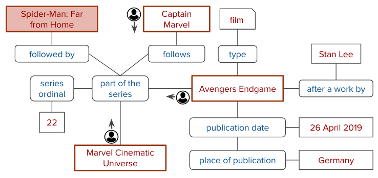

CONQUER: Reinforcement Learning from Reformulations for Conversational QA over KGs
============

Description
------------

This repository contains the code and data for our SIGIR'21 full paper. In this paper, we present CONQUER, a reinforcement learning model that can learn from a conversational stream of questions and reformulations. A reformulation is likely to be triggered by an incorrect system response, whereas a new follow-up question could be a positive signal on the previous turn’s answer. CONQUER is trained via noisy rewards coming from the reformulation likelihoods.
The answering process is modeled as multiple agents walking in parallel on the knowledge graph: 

*KG excerpt required for answering "When was Avengers: Endgame released in Germany?" and "What was the next from Marvel?".
Agents are shown with possible walk directions. The colored box ("Spider-man: Far from Home") is the correct answer.*

For more details see our paper:

[Reinforcement Learning from Reformulations in Conversational Question Answering over Knowledge Graphs](https://arxiv.org/abs/2105.04850), Magdalena Kaiser, Rishiraj Saha Roy and Gerhard Weikum, in Proceedings of the 44th International ACM SIGIR Conference on Research and Development in Information Retrieval 2021 (SIGIR '21), Virtual Event, Canada, 11 - 15 July 2021 (to appear).

Setup 
------

The following software is required:

* Python 3.7

* Spacy 2.1.6

* Numpy 1.20.1

* Tensorflow 2.20

* Transformers 3.5.1

* TF-Agents 0.5.0

* Neo4j 1.7.2

To install the required libraries, it is recommended to create a virtual environment:

        python3 -m venv ENV_conquer
        source ENV_conquer/bin/activate
        pip install -r requirements.txt

Data
------
The benchmark and all required intermediate data can be downloaded from here (put it in the root of the cloned github repo):

        wget https://conquer.mpi-inf.mpg.de/static/data.zip -O data.zip
        unzip data.zip
        

Training CONQUER
------
Execute in the `main` directory:

        source ENV_conquer/bin/activate
        python rlMain.py configs/train_REFTYPE_USERTYPE_config.json

where REFTYPE can be *idealRef* or *noisyRef* to select the ideal/noisy reformulation predictor 
and USERTYPE can be *idealUser* or *noisyUser* to apply the ideal/noisy user model respectively

Further details about the config parameters can be found in the `configs` folder. 
The provided config files use the pre-computed data (downloaded at the previous step). For creating the required data from scratch see **Running Data Preprocessing Steps** below.

Evaluating CONQUER
------
Execute in the `main` directory:

        source ENV_conquer/bin/activate
        python rlEval.py configs/eval_REFTYPE_USERTYPE_EVALTYPE_config.json

where REFTYPE can be *idealRef* or *noisyRef* to select the ideal/noisy reformulation predictor 
and USERTYPE can be *idealUser* or *noisyUser* to apply the ideal/noisy user model respectively
and EVALTYPE can be *test* or *dev* to use the ConvRef test or devset.

Training & Evaluating Reformulation Predictor
-------
More details coming soon

Running Context Entity Detection
------
We use ELQ as our NED tool. To make use of it, clone the following repo:
       git clone https://github.com/facebookresearch/BLINK.git

and perform the setup steps described here: https://github.com/facebookresearch/BLINK/tree/master/elq

More details coming soon

Running Data Preprocessing Steps
------
More details coming soon

Running KG Preparation Steps
------

More details coming soon

