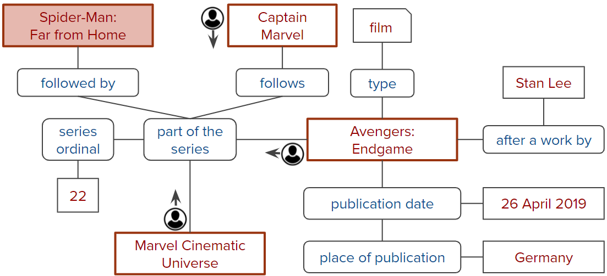

CONQUER: Reinforcement Learning from Reformulations in Conversational QA over KGs
============

Description
------------

This repository contains the code and data for our SIGIR'21 full paper. In this paper, we present CONQUER, a reinforcement learning model that can learn from a conversational stream of questions and reformulations. A reformulation is likely to be triggered by an incorrect system response, whereas a new follow-up question could be a positive signal on the previous turn’s answer. CONQUER is trained via noisy rewards coming from the reformulation likelihoods.
The answering process is modeled as multiple agents walking in parallel on the knowledge graph: 



*KG excerpt required for answering "When was Avengers: Endgame released in Germany?" and "What was the next from Marvel?".
Agents are shown with possible walk directions. The colored box ("Spider-man: Far from Home") is the correct answer.*

For more details see our paper: [Reinforcement Learning from Reformulations in Conversational Question Answering over Knowledge Graphs](https://arxiv.org/abs/2105.04850)

If you use this code, please cite:
```bibtex
@inproceedings{kaiser2021reinforcement,
  title={Reinforcement Learning from Reformulations in Conversational Question Answering over Knowledge Graphs},
  author = {Kaiser, Magdalena and Saha Roy, Rishiraj and Weikum, Gerhard},
  booktitle={SIGIR},
  year={2021}
 }
```

Setup 
------

The following software is required:

* Python 3.7

* Spacy 2.1.6

* Numpy 1.20.1

* Tensorflow 2.20

* Transformers 3.5.1

* TF-Agents 0.5.0

* Neo4j 1.7.2

* Scikit-learn 0.21.2

To install the required libraries, it is recommended to create a virtual environment:

    python3 -m venv ENV_conquer
    source ENV_conquer/bin/activate
    pip install -r requirements.txt


Data
------
The benchmark and all required intermediate data can be downloaded from here (unzip and put it in the root folder of the cloned github repo): https://conquer.mpi-inf.mpg.de/static/data.zip 

        

Training CONQUER
------
Execute in the `main` directory:

    python rlMain.py configs/train_REFTYPE_USERTYPE_config.json

where REFTYPE can be *idealRef* or *noisyRef* to select the ideal/noisy reformulation predictor 
and USERTYPE can be *idealUser* or *noisyUser* to apply the ideal/noisy user model respectively

Further details about the config parameters can be found in the `configs` folder. 
The provided config files use the pre-computed data (downloaded at the previous step). For creating the required data from scratch see **Running Data Preprocessing Steps** below.

Evaluating CONQUER
------
Execute in the `main` directory:

    python rlEval.py configs/eval_REFTYPE_USERTYPE_EVALTYPE_config.json

where REFTYPE can be *idealRef* or *noisyRef* to select the ideal/noisy reformulation predictor, USERTYPE can be *idealUser* or *noisyUser* to apply the ideal/noisy user model
and EVALTYPE can be *test* or *dev* to use the ConvRef test or devset respectively.

Training & Evaluating Reformulation Predictor
-------
Execute in the `reformulation_prediction` directory:

1. Create the datasets for fine-tuning BERT:

```python
   python createRefDataset.py 
```

2. Train the reformulation predictor (fine-tune BERT model):

```
   python finetuneRefPredictor.py
```

3. Evaluate the performance of the reformulation predictor:
```
   python refPredictEval.py
```

OPTIONAL: Running Context Entity Detection
------
The context entities (= startpoints for the RL walk) along with their respective KG paths (= actions) have been pre-computed and can directly be used (see **Data** section above) for the RL. In case you want to re-run the context entity detection, the following is required:

1. We use ELQ as our NED tool. To make use of it, clone the following repo:
```
   git clone https://github.com/facebookresearch/BLINK.git
```  
   Place the BLINK directory inside the root directory of CONQUER and perform the setup steps described here: https://github.com/facebookresearch/BLINK/tree/master/elq


2. Access to our KG, which has been loaded into a neo4j database, is required. Our neo4j database can be downloaded here: https://conquer.mpi-inf.mpg.de/static/neo4j.zip.

   Alternatively, you can build it from scratch (see **Running KG Preparation Steps** below).

   Note that the provided version is for Linux. 
The unzipped version requires around 65 GB of disk space and around 35 GB of RAM is necessary to run the database.

   Start the database with the following command:

```
   neo4j-community-4.0.5/bin/neo4j start
```

3. Once the database is running, execute the following command in the `context_entity_detection` directory:

```
   python contextEntityRetrieval.py
```

OPTIONAL: Running Data Preprocessing Steps
------
We provide the preprocessed data (see above) for easy usage. In case you want to build it from scratch, the following steps are necessary:

Execute in the `data_preprocessing` directory:

1. Process the benchmark data:

```python
   python processConvRefData.py 
```
2. Encode questions and actions with BERT:

```python
   python doBertEncoding.py
```

3. Encode the conversation history (in case you want to include it):

```python
   python encodeConversationHistory.py 
```

4. Make best use of the retrieved context entities (for training only):

```python
   python prepareStartPoints.py 
```

5. Pre-compute reformulation predictions (for training only):

```python
   python precomputeRefPredictions.py 
```

OPTIONAL: Running KG Preparation Steps
------

More details coming soon


